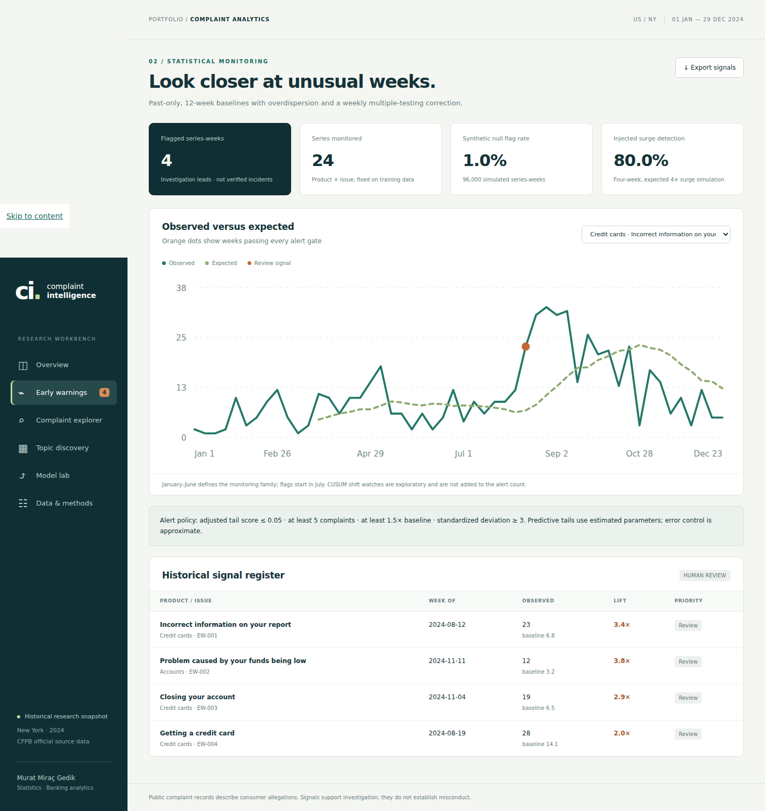
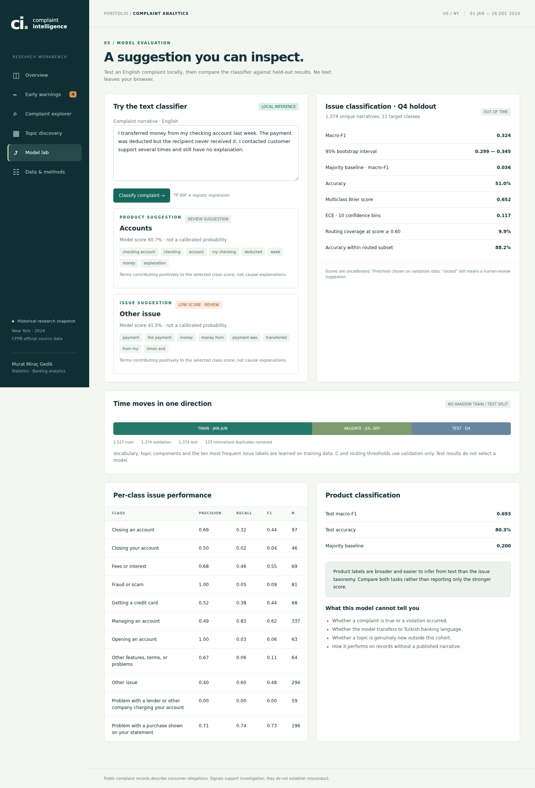

# Banking Complaint Intelligence & Early Warning

A small research workbench for finding recurring issues and unusual reporting patterns in banking complaints. It combines a reproducible Python analysis with a browser interface for exploring the results.

**Murat Miraç Gedik** · Statistics / Banking analytics

[](https://github.com/muratmiracg-dev/banking-complaint-intelligence-early-warning/actions/workflows/ci.yml)
[](https://github.com/muratmiracg-dev/banking-complaint-intelligence-early-warning/actions/workflows/codeql.yml)

[Türkçe](README.tr.md) · [Methods](docs/methodology.md) · [Development notes](docs/decisions.md) · [Validation](docs/validation.md) · [Interview study notes](docs/interview-notes.tr.md)


<details>
<summary>More application screens</summary>





</details>

## The question

Which problems recur in customers' descriptions, and which product–issue pairs receive more complaints than their recent history would suggest?

The pilot covers **New York, 1 January–29 December 2024**, across checking/savings accounts, credit cards and money transfers/virtual currency/money services. Counts describe complaints received by the CFPB. They are not product failure rates or rankings of bank quality.

## Open the workbench

1. Select **Code → Download ZIP**, then extract the archive.
2. Open **`web/index.html`** in a desktop browser.
3. Use **Model lab** to classify an English complaint, or explore the historical signals and selected narrative excerpts.

The bundled version works offline and needs no API key, Python installation or cloud account. It includes 184 selected excerpts; it is not a search index of the whole cohort. GitHub's file viewer displays the HTML source, so download the repository before opening it. There is no hosted website in this repository.

For full local text search, follow the rebuild instructions below and run `python app.py`, then open <http://127.0.0.1:8765>.

## What is implemented

| View | What you can inspect |
|---|---|
| Overview | Weekly counts, product mix and leading historical signals |
| Early warnings | Observed/expected series, alert gates and a downloadable register |
| Complaint explorer | Text/metadata search, product filter, individual records and product–issue counts |
| Topic discovery | Eight learned themes, representative excerpts and recent share changes |
| Model lab | Local text classification, contributing terms and held-out metrics |
| Data & methods | Source hashes, scope, rebuild commands and interpretation limits |

Python handles data preparation, TF-IDF/logistic regression, NMF and count monitoring. The interface uses plain HTML/CSS/JavaScript. SQLite and CSV outputs support follow-up analysis. There are no external model calls or browser analytics.

## Results from the committed run

| Measure | Result |
|---|---:|
| Complaint metadata records | 10,750 |
| Published narratives matched from the official archive | 5,415 |
| Unique narratives used for modeling | 5,275 |
| Train / validation / test records | 2,527 / 1,374 / 1,374 |
| Product test macro-F1 | 0.693 |
| Issue test macro-F1 | 0.324 |
| Issue majority baseline macro-F1 | 0.036 |
| Monitored product–issue pairs | 24 |
| Review signals, July–December | 4 |

The issue classifier is a limited baseline. Its overall test accuracy is 51.0%. At a validation-selected score threshold of 0.60, only 9.9% of test records qualify for suggested routing; that subset has 88.2% accuracy. **The subset score must not be presented as overall model performance.** Model scores are uncalibrated, and every suggestion remains subject to review.

There are no verified incident labels. The four flags need investigation. A separate negative-binomial simulation produces a 0.99% null series-week flag rate and 80% detection of injected four-week surges. Those are simulation results, not measured real-world false-alarm and detection rates.

## A source change that matters

The CFPB removed narratives from its live database in **September 2026**. The importer therefore uses current metadata and joins text from the CFPB's [official narrative archive](https://www.consumerfinance.gov/foia-requests/foia-electronic-reading-room/cfpb-consumer-complaint-database-narratives-archive/) by complaint ID.

All four archive files and the metadata export have recorded SHA-256 hashes in [source_manifest.json](artifacts/source_manifest.json). Full source records stay local. A fresh download can differ because the current database changes; matching hashes are needed to reproduce this exact snapshot.

Received dates are not publication dates. This is a retrospective analysis, not a claim that the system could have detected these issues live in 2024.

## Rebuild the analysis

Python 3.11 or 3.12 is recommended. Run from the repository root.

```bash
python -m venv .venv
# macOS / Linux
source .venv/bin/activate
# Windows PowerShell: .venv\Scripts\Activate.ps1

python -m pip install -r requirements.txt
python -m complaint_intelligence fetch
python -m complaint_intelligence build
python -m complaint_intelligence validate
python app.py
```

The first fetch downloads approximately 290 MB of official archives and filters them in chunks. Existing downloaded files are reused. Delete the local source files deliberately if you want a refreshed snapshot. Raw archives, full narratives and the database are excluded from Git.

To rebuild from your own permitted CSV in the same declared cohort:

```bash
python -m complaint_intelligence build --input path/to/cohort.csv
```

The input must contain `id`, `date`, `product`, `issue`, `state` and `narrative`; the equivalent CFPB export headings are also recognized. It must satisfy the date, geography and product contract. An unrelated input is not silently attributed to the committed official source manifest. See the [data contract](docs/data-contract.md).

## Check the implementation

```bash
python -m unittest discover -s tests -v
python -m complaint_intelligence validate
node tests/test_inference.cjs
```

The Python tests cover source validation, duplicate handling, temporal boundaries, past-only monitoring, multiplicity adjustment, CSV safety and the local API. JavaScript checks compare portable predictions with Python. The browser smoke test checks navigation, filtering, dialogs, inference and mobile width:

```bash
npm ci --ignore-scripts
npx playwright install chromium
# With python app.py running in another terminal:
npm run test:browser
```

CI runs on Python 3.11 and 3.12 and opens the offline browser report. CodeQL and Dependabot configuration are included. Those files do not imply that branch protection or every GitHub account setting has been enabled.

## Useful files

| Path | Purpose |
|---|---|
| `complaint_intelligence/data.py` | Official-source import, archive join and validation |
| `complaint_intelligence/model.py` | Time split, text models, metrics and portable inference |
| `complaint_intelligence/alerts.py` | Weekly count scoring and simulation benchmark |
| `complaint_intelligence/pipeline.py` | Rebuild report, model, CSV and SQLite outputs |
| `web/` | Offline application and committed analytical snapshot |
| `artifacts/validation.json` | Per-class metrics, confusion matrices and simulation results |
| `artifacts/alerts.csv` | Four historical review signals |
| `sql/analysis.sql` | Cohort reconciliation and investigation queries |

## Current limitations and next work

The issue taxonomy has overlapping labels, and some classes are rarely predicted. Near-duplicate templates can remain after exact normalization. Topic counts are a design choice, and topic growth is exploratory. The count monitor does not adjust for holidays or exposure, and it only covers pairs selected in the training period.

The most useful next steps are a reviewed error sample, better issue-label definitions, near-duplicate grouping and publication-time data collection. Turkish-language validation would require an appropriate local dataset.

MIT applies to the project code. CFPB source records retain their source terms and attribution. This project is not affiliated with the CFPB. See [security notes](SECURITY.md) before using the local server with sensitive data.
