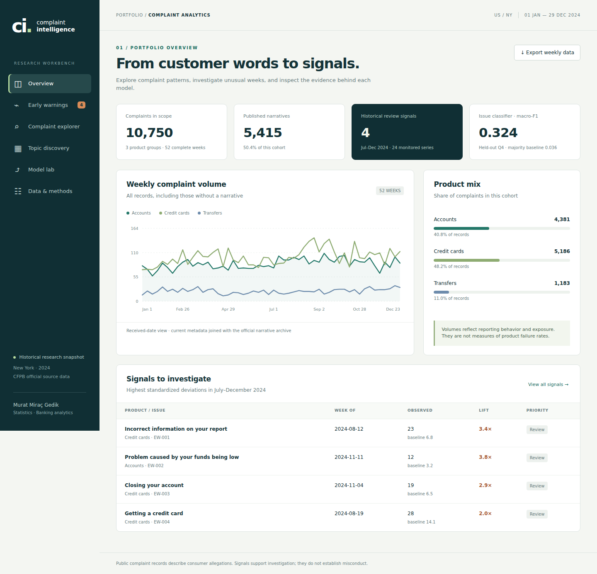

# Bankacılık Şikâyet Analizi ve Erken Uyarı

Müşterilerin şikâyet metinlerinde tekrar eden sorunları inceleyen ve bazı haftalardaki olağandışı kayıt artışlarını belirleyen bir araştırma projesi.

**Murat Miraç Gedik** · İstatistik / Bankacılık analitiği

[English README](README.md) · [Yöntemler](docs/methodology.md) · [Geliştirme notları](docs/decisions.md) · [Türkçe mülakat çalışma rehberi](docs/interview-notes.tr.md)



## Nasıl açılır?

Depoda **Code → Download ZIP** seçeneğiyle dosyaları indirip çıkart. Ardından `web/index.html` dosyasını tarayıcıda aç. Hazır rapor için kurulum, API anahtarı veya internet bağlantısı gerekmiyor.

Model lab ekranına İngilizce bir şikâyet yazıp ürün/sorun önerisini ve tahmine katkı veren kelimeleri görebilirsin. Uygulamada genel görünüm, erken uyarılar, şikâyet arama, konu keşfi, model değerlendirmesi ve veri/yöntem ekranları var.

Hazır sürümde 184 seçilmiş kısa alıntı bulunuyor. Bütün veri üzerinde yerel metin araması için aşağıdaki veri indirme ve yeniden oluşturma adımları gerekiyor. GitHub HTML dosyasını doğrudan uygulama olarak çalıştırmaz; indirip açmalısın.

## Kapsam ve sonuçlar

2024'ün 52 tam haftası için New York kayıtları kullanılıyor: hesap, kredi kartı ve para transferi grupları. Gerçek CFPB metadatası, kurumun resmî anlatım arşivleriyle ID üzerinden eşleştiriliyor.

| Gösterge | Sonuç |
|---|---:|
| Şikâyet kaydı | 10.750 |
| Yayımlanmış anlatım | 5.415 |
| Modelleme için benzersiz anlatım | 5.275 |
| Ürün modeli test macro-F1 | 0,693 |
| Sorun modeli test macro-F1 | 0,324 |
| Sorun modeli çoğunluk baseline'ı | 0,036 |
| İzlenen ürün/sorun serisi | 24 |
| Temmuz–Aralık inceleme sinyali | 4 |

Sorun sınıflandırma modeli otomatik karar vermek için güçlü bir sonuç üretmiyor. Genel test doğruluğu %51,0. Yalnızca skoru 0,60 üstündeki yaklaşık %9,9'luk alt kümede doğruluk %88,2; bu oran bütün modele mal edilemez. Düşük skorlu tahminler inceleme gerektiriyor.

Dört uyarı doğrulanmış operasyon sorunu anlamına gelmiyor. Gerçek olay etiketleri bulunmadığı için yanlış alarm deneyi ayrıca sentetik seriler üzerinde yapıldı.

## Neden canlı API ve arşiv birlikte kullanılıyor?

CFPB Eylül 2026'da metinleri canlı veritabanından kaldırdı. Bu nedenle eski anlatımlar resmî arşivden, metadata güncel API'den geliyor. Kaynak dosyalarının hash'leri saklanıyor. Şikâyetin alınma tarihi metnin kamuya açıldığı tarih değildir; sonuçlar tarihsel bir analizdir.

## Yeniden çalıştırma

Python 3.11 veya 3.12 ile, depo klasöründe:

```bash
python -m venv .venv
# Windows PowerShell:
.venv\Scripts\Activate.ps1
# macOS/Linux: source .venv/bin/activate
python -m pip install -r requirements.txt
python -m complaint_intelligence fetch
python -m complaint_intelligence build
python -m complaint_intelligence validate
python app.py
```

Sonra `http://127.0.0.1:8765` adresini aç. İlk veri indirmesi yaklaşık 290 MB. Ham kayıtlar ve tam metinler bilgisayarda kalıyor, Git'e eklenmiyor.

Testler:

```bash
python -m unittest discover -s tests -v
node tests/test_inference.cjs
```

Yöntemler, zaman ayrımı, veri sınırları ve mevcut eksikler İngilizce yöntem dosyasında ayrıntılı açıklanıyor. Türkçe çalışma rehberi, projeyi mülakatta anlatırken hangi kararları anlaman gerektiğini gösteriyor.
